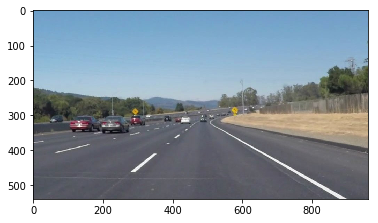
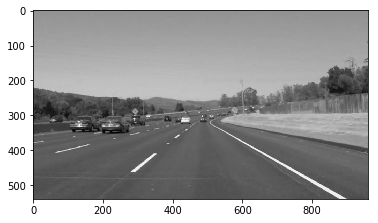
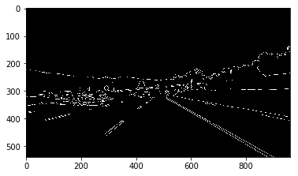
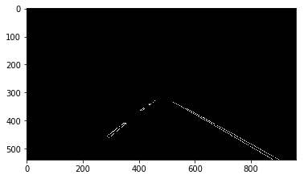
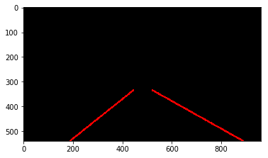

# Project 1 - Finding the lane lines

## Concepts learned:
* Region Masking
* Gaussian Blur
* Canny Edge detection
* Hough transform

## Action plan:
* Convert the image to grayscale
* Smoothen the edges using Gaussian blur
* Find the edges using Canny edge detector
* Mask the image
* Find lines using Hough transform
* Fit the points in a line and extrapolate the line

### Pipeline

Taking a sample image.

Grayscaling the image. 

Applying Gaussian Blur to smoothen image and remove noise. 

Image after applying Canny Edge Detection Algorithm.

Masking the image to a region of interest as the upper part of image contains Sky and the lane lines are in the center.

Applying Hough Transform to find line segments and extrapolating them to find two lane lines.

Finally drawing the lines on the orignal image.

This pipeline is ran on the video and the output can be seen here.[Video Output](https://youtu.be/cbQyKotdif4)
